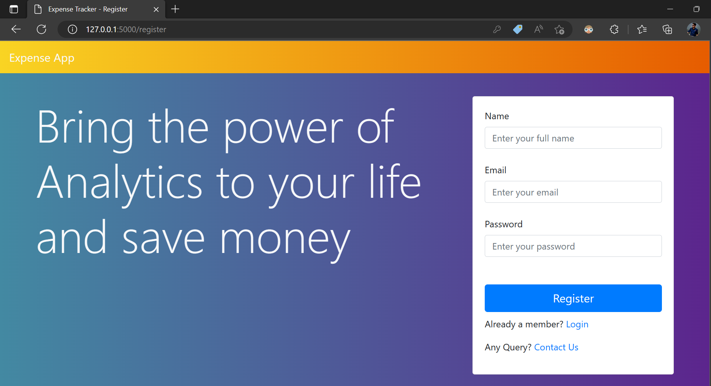

# Flask_Expense_App
Creating a simple Expense Track app using Flask and Python

1. Create New Repository in GitHub as `Flask_Expense_App`
2. Clone this repo in local env `git repo https://github.com/santos-k/Flask_Expense_App.git`
3. Open VS Code or Pycharm
    1. Open the Project
       1. File and Directory structure
          1. `main.py`
          2. templates
             1. login.html
             2. register.html
             3. contact.html
             4. home.html
             5. analysis.html
             6. profile.html
          3. static 
             1. css
                1. style.css

## Update
1. Password Reset Functionality added inside login page
2. Password can be changed for existing user with authentication
3. Email and password are required field, if not entered cannot proceed
4. valid email format alert
5. after reset form submitting will redirect to login page

- Changing password for an existing u
- ser
 

- Changing password for non-existing user
  

                    

## Freeze requirements.txt
save packages used in project, run below command to auto generate requirements.txt will all packages
`pip freeze > requirements.txt`
